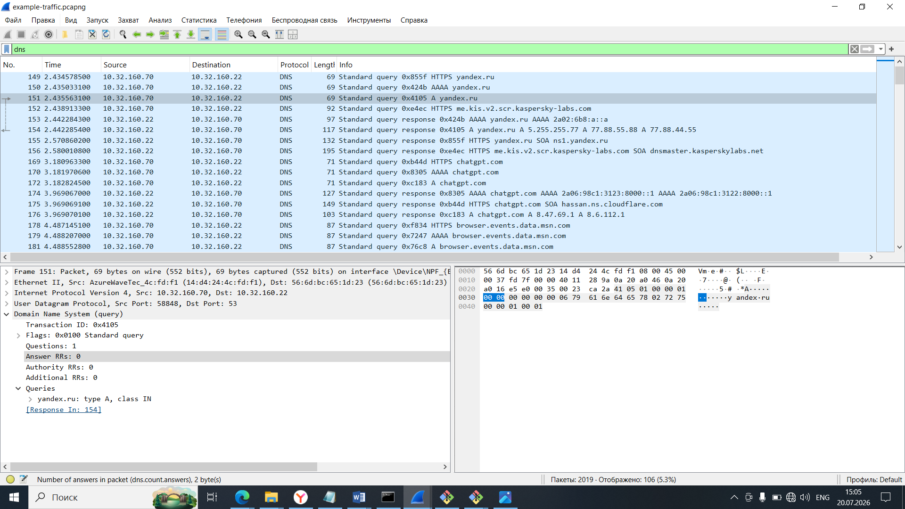
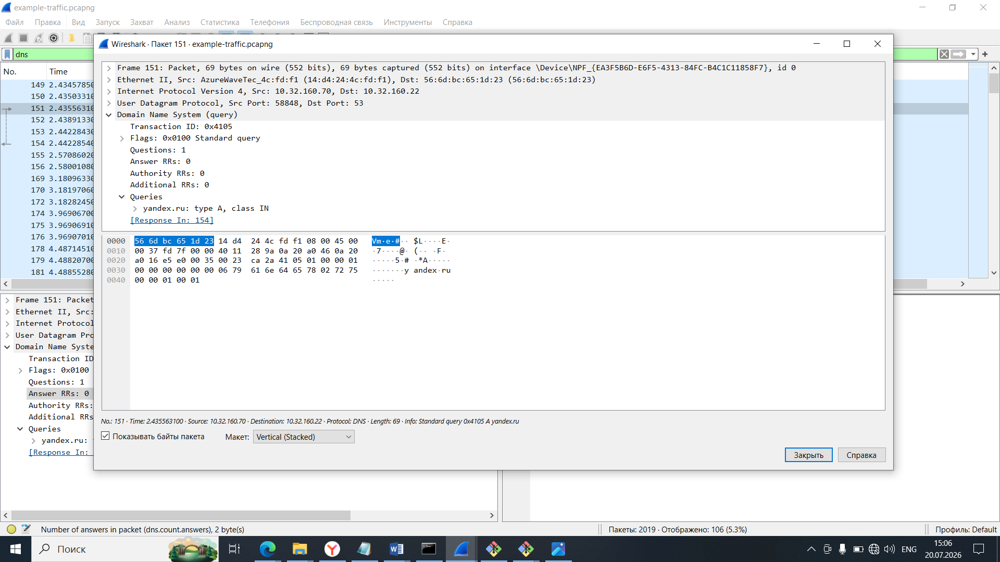
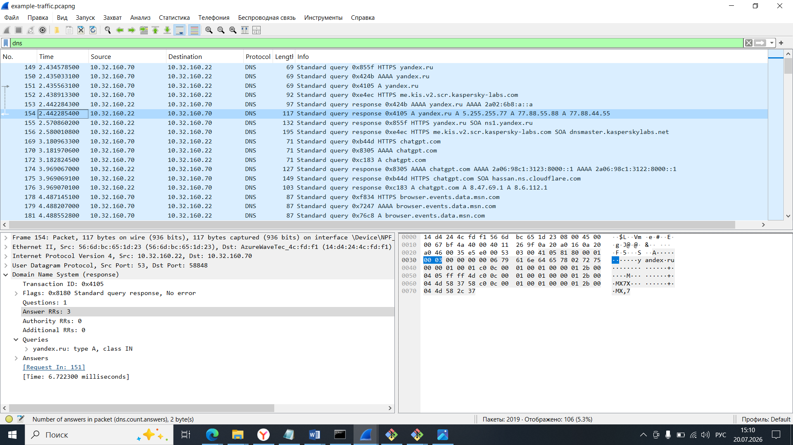

DNS Analysis

Goal
The goal of this lab was to analyze DNS traffic using Wireshark and understand how a domain name is translated into an IP address.

Tool Used
- Wireshark

Procedure
The packet capture file `example-traffic.pcapng` was opened in Wireshark. A DNS filter was applied to display only DNS packets. The DNS query for **yandex.ru** and its corresponding response were examined.

DNS Filter
The `dns` filter was used to display only DNS traffic in the packet capture.

DNS Query Analysis
The selected packet contains a standard DNS query for the domain **yandex.ru**.

The client requested an **A record**, which is used to obtain the IPv4 address of the domain.

Observations
- Domain Name: **yandex.ru**
- Record Type: **A**
- Query Type: **Standard DNS Query**
- Protocol: **DNS**

DNS Response Analysis
The DNS server successfully responded to the request and returned three IPv4 addresses for **yandex.ru**.

The returned addresses were:

- 5.255.255.77
- 77.88.55.88
- 77.88.44.55

The response was received in approximately **6.7 milliseconds**, indicating normal DNS performance.

Observations
- Status: **No error**
- Answer Records: **3**
- Domain successfully resolved
- Multiple IP addresses were returned for load balancing

Conclusion
The DNS analysis demonstrates a successful domain name resolution process. The client requested the IPv4 address of **yandex.ru**, and the DNS server returned three valid IP addresses without errors. This behavior is expected for large websites that use multiple servers to improve reliability and performance.
