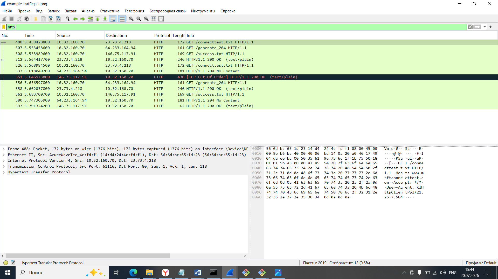
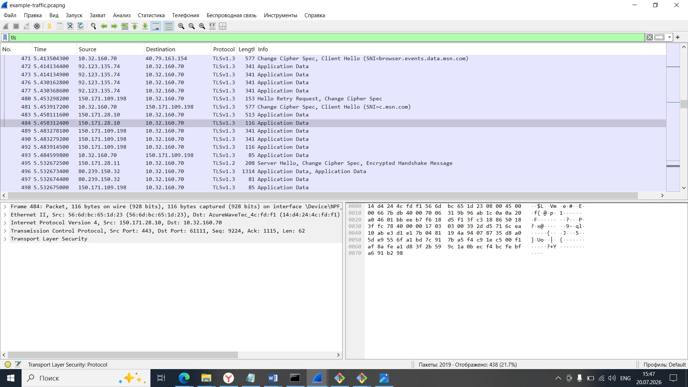

HTTP vs HTTPS Analysis

Goal
The purpose of this lab was to compare HTTP and HTTPS traffic using Wireshark and understand how encrypted and unencrypted communication differ.

Tool Used
- Wireshark

Procedure
The packet capture file `example-traffic.pcapng` was opened in Wireshark.

First, the filter

`http`
was applied to display HTTP packets.
Then the filter

`tls`
was applied to display encrypted HTTPS traffic.

Analysis

When the HTTP filter was applied, several HTTP requests and responses became visible. Requests such as GET `/connecttest.txt` and GET `/generate_204` were displayed together with HTTP status codes like `200 OK` and `204 No Content`.
The request path, headers and protocol information can be read directly because HTTP traffic is not encrypted.

HTTP traffic:

After applying the TLS filter, encrypted HTTPS traffic became visible.

The capture contains TLS handshake messages including Client Hello and Server Hello, followed by encrypted Application Data packets.

Unlike HTTP, the website content and transmitted data cannot be read because TLS encrypts the communication.

TLS traffic:

Conclusion

This analysis demonstrates the main difference between HTTP and HTTPS.
HTTP transmits information in plain text, allowing anyone who captures the traffic to read its contents.
HTTPS protects communication using TLS encryption. Although the handshake process is visible, the transmitted data remains encrypted and cannot be viewed directly in Wireshark.
