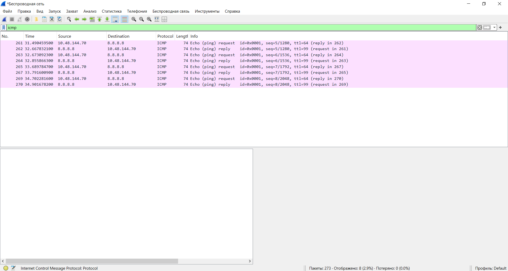
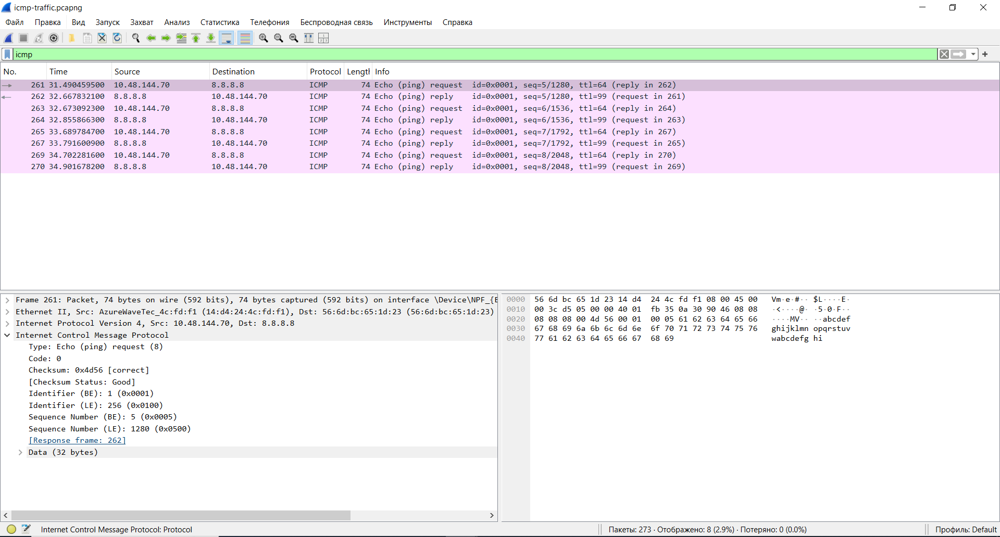

ICMP (Ping) Analysis

Goal
The purpose of this lab was to analyze ICMP traffic using Wireshark and understand how the Ping utility works.

Tool Used
- Wireshark
- Windows Command Prompt (ping)

Procedure

A new packet capture was started in Wireshark.
The following command was executed in the Windows Command Prompt:

`ping 8.8.8.8`
After the capture was completed, the filter

`icmp`
was applied to display only ICMP packets.

Analysis

The packet capture contains ICMP Echo Request and Echo Reply packets exchanged between the local computer and Google's public DNS server (8.8.8.8).

Each Echo Request sent by the client received a corresponding Echo Reply from the server, confirming successful communication.

The selected packet shows the ICMP header, including the packet type, code, checksum, identifier, and sequence number.

ICMP traffic:

ICMP packet details:

Conclusion
The analysis demonstrates how the ICMP protocol is used to test network connectivity.
Each Echo Request generated by the Ping command received a successful Echo Reply, indicating that the destination host was reachable and the network connection was functioning correctly.
