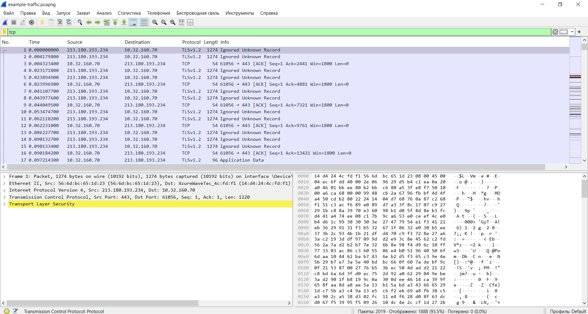
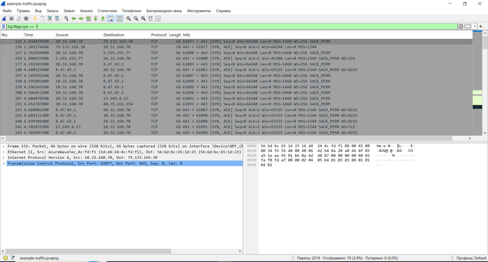

TCP Handshake Analysis

Goal
The purpose of this lab was to observe and analyze the TCP three-way handshake using Wireshark. The objective was to understand how a TCP connection is established between a client and a server.

Tool Used
- Wireshark

Procedure
The packet capture file `example-traffic.pcapng` was opened in Wireshark. TCP traffic was filtered to display only TCP packets. The connection establishment process was then examined by identifying the SYN, SYN/ACK, and ACK packets.

TCP Traffic Filter
The `tcp` display filter was applied to display only TCP traffic in the packet capture.

TCP Three-Way Handshake Analysis

The TCP three-way handshake is the process used to establish a reliable connection between a client and a server.

The connection begins when the client sends a **SYN** packet to the server requesting to start a new TCP session.

The server replies with a **SYN/ACK** packet, acknowledging the request and indicating that it is ready to establish the connection.

Finally, the client sends an **ACK** packet to confirm the connection. After this exchange, the TCP session is successfully established.

Observations
- Protocol: **TCP**
- Connection initiated with a **SYN** packet.
- Server responded with **SYN/ACK**.
- Client completed the handshake with **ACK**.
- The connection was successfully established.

Conclusion
The packet capture demonstrates a successful TCP three-way handshake. All three required packets (SYN, SYN/ACK, and ACK) are present, confirming that the client and the server established a reliable TCP connection before exchanging data.
